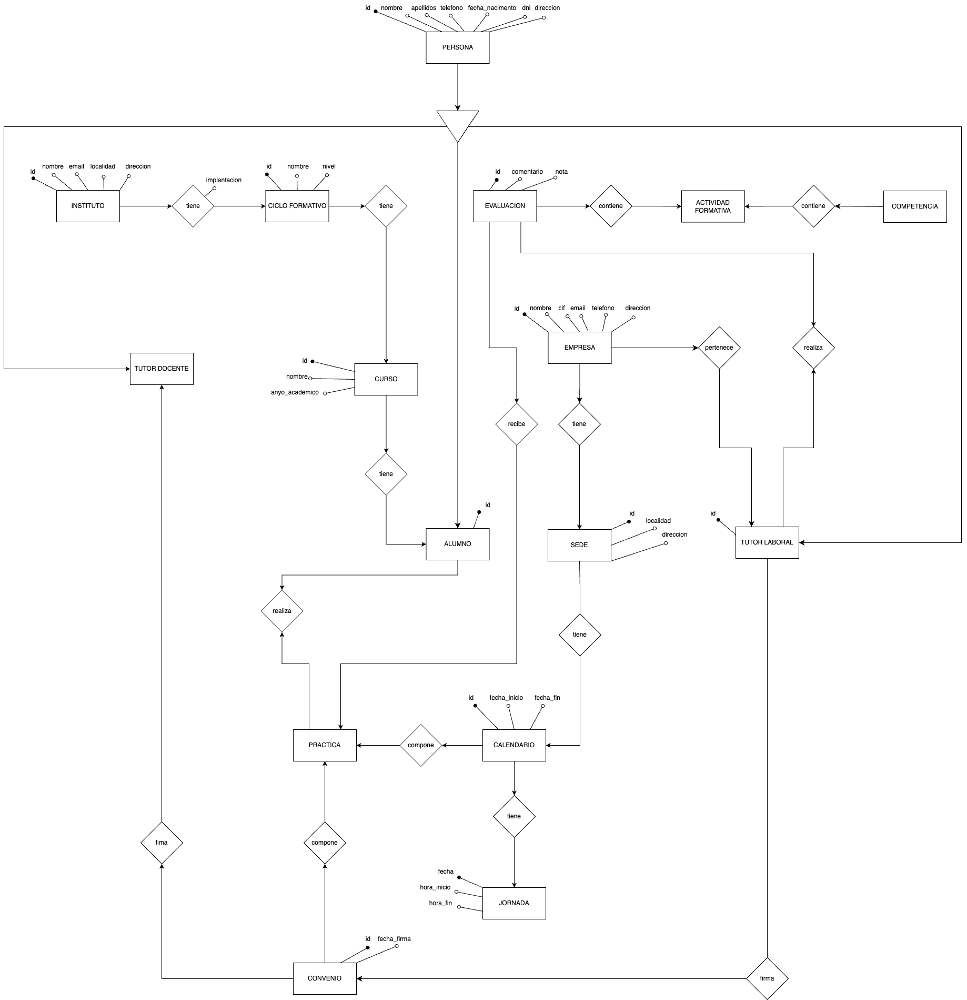

# 🎓 Proyecto de Gestión de Prácticas FCT - FP Dual

Este proyecto representa un sistema de gestión completo para las **prácticas de Formación en Centros de Trabajo (FCT)** dentro de programas de FP Dual, diseñado y modelado en **MySQL Workbench** y desarrollado con un enfoque relacional sólido.

📌 **Autores**:  
- Juan Antonio Jiménez Hornillo  
- Francisco José Vergara Rodríguez  

📅 **Curso académico**: 2024-2025

---

## 🧠 Descripción del proyecto

El sistema cubre toda la lógica necesaria para gestionar las prácticas de estudiantes en empresas, incluyendo la asignación de tutores, seguimiento de actividades, convenios, calendarios y evaluaciones. Representa las relaciones reales entre centros educativos, empresas, tutores y alumnado, garantizando integridad referencial y organización.

## 🏗️ Estructura general

Basado en un modelo E/R relacional que cuenta con las siguientes entidades principales:

- **Persona**: entidad base de la que derivan alumnos y tutores
- **Alumno**: persona que cursa prácticas en una empresa
- **Tutor docente / Tutor laboral**: roles asociados a personas específicas
- **Empresa** y **Sede**: permite múltiples sedes por empresa
- **Instituto**, **Ciclo Formativo**, **Oferta Formativa** y **Curso**
- **Competencias** y **Actividades formativas**
- **Convenios** y **Prácticas**
- **Evaluaciones**, **Calendario** y **Jornadas**

🧩 Cada tabla respeta las cardinalidades indicadas en el modelo E/R y tiene una estructura clara que permite escalar y mantener el sistema a lo largo del tiempo.

> 📎 Puedes ver el modelo E/R en el archivo `FP_DUAL_E-R.png` incluido en este repositorio.

---

## 💾 ¿Qué incluye este repositorio?

- Script completo de creación de base de datos `FP_Dual` en MySQL
- Población con **10 inserts por cada tabla** con datos variados y coherentes
- Integridad de claves primarias y foráneas
- Comprobaciones (`CHECK`) y procedimientos (`PROCEDURE`) para facilitar tareas como inserción automática de jornadas

---

## 🚀 Cómo utilizarlo

1. Clona el repositorio:
   ```bash
   git clone https://github.com/tuusuario/FP_Dual.git
   cd FP_Dual
   ```

2. Abre el archivo `.sql` en MySQL Workbench u otro cliente compatible.

3. Ejecuta el script de creación para generar la base de datos y poblarla con datos de prueba:
   - `FP_Dual.sql` contiene la estructura + datos

---

## 🧠 Características destacadas

✅ Relación realista entre alumnos, tutores y empresas  
✅ Multiplicidad de sedes por empresa  
✅ Un mismo grado puede impartirse en varios institutos  
✅ Calendario de jornadas con horas y fechas  
✅ Evaluaciones asociadas a competencias reales

---

## 📈 Posibles mejoras

- Desarrollo de un frontend web con formularios CRUD
- Integración de roles (admin, tutor, alumno)
- Exportación de convenios o informes en PDF
- Visualización de estadísticas y progresos

---

## 🛠️ Tecnologías utilizadas

- MySQL Workbench
- SQL puro (DDL + DML)
- Git + GitHub

---

## 📸 Captura del modelo E/R



---

## 📃 Licencia

Este proyecto ha sido desarrollado como parte de una práctica académica. Puedes usarlo como base para tus propios desarrollos con fines educativos o personales.

---

> ✨ Gracias por revisar este trabajo. Si te ha resultado útil o interesante, no dudes en dejar una estrella ⭐ en el repositorio o clonarlo para tus propios proyectos.
